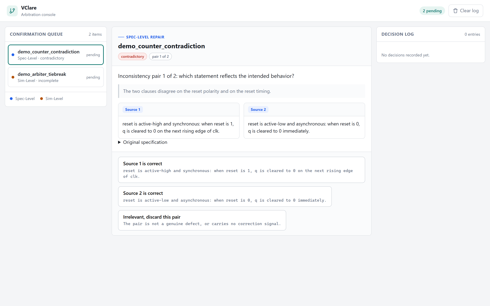
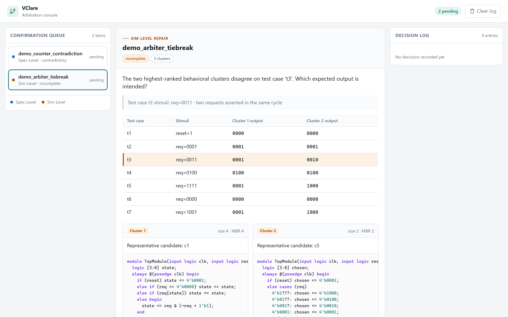
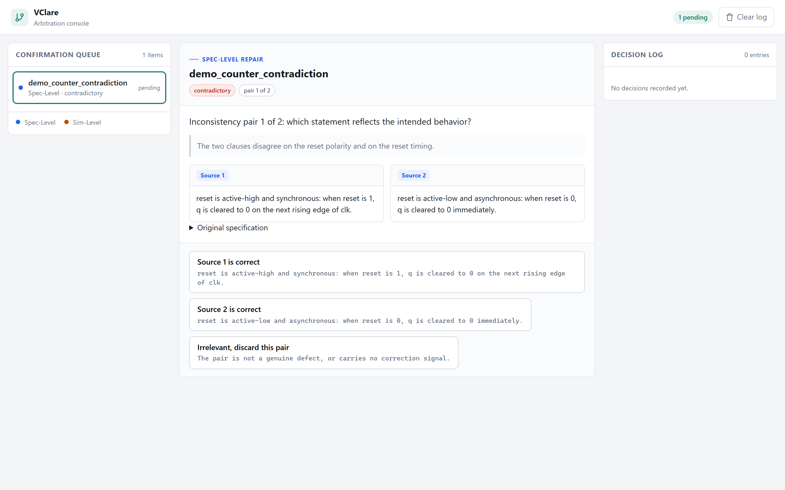

# VClare

本仓库是 VClare 框架的开源实现。相关论文已被 NeurIPS Workshop on AI for Chip Design 接收。

VClare 是一套面向"不完美硬件规格"（imperfect specification）的 Verilog 生成修复框架。
硬件设计规格中常见的 **contradiction（矛盾）**、**incompleteness（不完整）** 和
**vagueness（含糊）** 会显著降低 LLM 生成 RTL 的正确率。VClare 通过两条互补的路径
恢复设计意图：

1. **Spec-Level Repair**：在规格文本层面进行语义不一致挖掘（inconsistency mining），
   由人工完成一次确认，再由 LLM 做最小化定向修改。
2. **Sim-Level Repair**：不修改规格，而是从规格采样多个实现，自动生成 testbench 并仿真，
   按行为等价性聚类，再用 MBR 一致性分数排序；当存在多个可行行为簇时，在最能区分第 1、2 名
   簇的 test case 上请求人工确认。

> 本仓库只包含框架代码，便于读者按串行顺序理解框架。仓库不包含原始/注入缺陷的规格
> （可手动接入论文开源的数据集），也不包含 LLM 生成的候选实现。仓库中可直接运行的是一个
> **合成 demo**，用于验证流程与人工接口。如需复现实验，需要对本框架做并行化处理，并建议在
> LLM 阶段之后批量提供人工反馈 JSON，否则实验进程会非常长。

---

## 1. VClare 方法

### 1.1 Spec-Level Repair

1. **语义不一致挖掘**：LLM 阅读原始规格 `S_orig`，最多给出 `m` 个不一致语句对
   `(a1, a2)`。如果某个"含糊/不完整"问题找不到第二条可引用语句，则令 `a2 = a1`，
   标记为 standalone 问题。
2. **人工确认**：把语句对呈现给工程师。工程师不需要改写规格、不需要写 test case，
   只需要给出一个最小信号：
   - `source1`：`a1` 反映预期行为，`a2` 应被修改；
   - `source2`：`a2` 反映预期行为，`a1` 应被修改；
   - `irrelevant`：该对不是真正的缺陷，丢弃。
3. **定向修复**：对确认有效的语句对，LLM 只修改被判定为错误的那一句，其余内容保持不变，
   得到修复后的规格 `S_repair`。

代码位置：`vclare/spec_repair.py`。

### 1.2 Sim-Level Repair

1. **候选生成**：从规格（`S_repair` 或原始 `S_orig`）以 temperature > 0 采样 `N`
   个 Verilog 实现 `{c_1, ..., c_N}`。
2. **自动 testbench**：LLM 生成一个包含多个 test case 的 testbench `T`。
3. **仿真与聚类**：用 Icarus Verilog 把每个候选跑在 `T` 上。编译失败或没有输出的候选各自
   成为单元素簇；其余候选按"所有 test case 输出完全一致"聚成行为等价簇
   `{C_1, ..., C_k}`。
4. **MBR 一致性排序**：第 1.4 节的公式给候选打分，簇按最高分排序，`C_1` 为第一名。
5. **可选的人工确认**：当 `k > 1` 时，找到 `C_1` 与 `C_2` 第一个输出不同的 test case
   `t_d`，把这个区分点呈现给工程师：
   - `cluster_1`：采用 `C_1` 在该 test case 上的行为；
   - `cluster_2`：采用 `C_2` 在该 test case 上的行为；
   - `abstain`：没有人工信号，退化为标准 VRank 选择（即直接取 `C_1`）。

代码位置：`vclare/sim_repair.py`。

### 1.3 两种范式的互补性

- Spec-Level Repair 依赖 LLM 的**长文本定位能力**：规格短、缺陷局部、且存在显式矛盾时效果
  最好；规格变长后容易定位失败，甚至产生"越修越坏"的伪修改。
- Sim-Level Repair 不要求 LLM 指出缺陷在哪，而是依赖**执行层行为共识**：在长规格、多模块
  场景下更稳健。
- 二者可以独立使用，也可以串行：Spec-Level 先做，Sim-Level 再对生成实现做行为验证。

### 1.4 MBR 一致性分数

对候选 `c`：

```
R(c) = n - sum_{c' in C} l(c, c')
```

其中 `l(c, c') = 1` 表示 `c` 与 `c'` 在任意 test case 上输出不同（或任一者仿真失败），
否则为 0。簇的分数取簇内成员的最高分，与 VRank 的簇排序一致。

---

## 2. 论文实验方法

这一节说明论文中自动化实验的设置。**数据与结果不在本仓库中**。

### 2.1 数据集构造

通过向正确规格注入三类语义缺陷来构造两个 benchmark：

| 数据集 | 来源 | 规模 | 特点 |
| --- | --- | --- | --- |
| VerilogEval-Defect | VerilogEval-human | 156 个单模块任务 x 3 类缺陷 | 规格较短，适合细粒度分析 |
| ComplexVDB-Defect | ComplexVDB / ReflectBench | 53 个多模块任务 x 3 类缺陷，覆盖 8 个设计域 | 规格长、结构冗余多，更接近真实工程文档 |

三类注入缺陷：

- **Contradiction**：不同章节出现互相冲突的语句，例如同时要求同步复位和异步复位、
  或同时要求高有效和低有效。
- **Incompleteness**：缺少边界情况或约束，例如 overflow 处理、复位行为、非法输入处理。
- **Vagueness**：缺少精确行为描述，使用有多种解释的措辞。

每个任务都保留原始**未修改**规格作为参考；VerilogEval 的 golden testbench **只在最终
评估阶段使用**，不参与修复过程。

### 2.2 模型与实现

| 项目 | 配置 |
| --- | --- |
| Backbone LLM | `deepseek-v4-flash`（记为 DS）、`gpt-5.4-nano`（记为 GPT） |
| Temperature | 默认值 |
| Reasoning effort | DS = low，GPT = medium |
| 仿真器 | Icarus Verilog (iverilog) v13.0 |
| 重复次数 | 每个配置独立运行 5 次，以抵消 LLM 非确定性 |
| 机器 | 2 x Xeon Gold 6126，280 GB RAM |

### 2.3 评估指标

主指标是 **pass@k**，`n = 10`：

```
pass@k = E_problems[ 1 - C(n - c, k) / C(n, k) ]
```

其中 `n` 是采样候选数，`c` 是其中通过 golden testbench 的候选数。聚类之后，pass@k 统计的是
"被选中的 top-k 候选里是否存在正确实现"。

### 2.4 基线与修复配置

**Baselines**

- **No Repair (Original)**：直接用有缺陷的规格生成 Verilog，不做任何修复。
- **Blind Fix**：仅告诉 LLM "规格可能有缺陷"，让它 zero-shot 先修规格再生成代码，
  不提供结构化挖掘或行为验证。
- **VRank**：原始 VRank 流程，只做执行层面的行为聚类与排序，不做 test-case 仲裁。
- **SpecFix-no-oracle**：把软件域的 SpecFix 适配到 Verilog：先生成多个实现，选出主导行为簇，
  用该簇反推修改规格，再从修改后的规格重新生成代码。

**VClare 配置**

- **Spec-Level Repair**：先挖掘 + 确认 + 定向修复，再从修复后的规格生成单个实现。
- **Sim-Level Repair**：直接在有缺陷的原始规格上采样候选、聚类、可选仲裁。
- **Hybrid Repair (NA)**：先 Spec-Level，再 Sim-Level，但 Sim-Level 不做仲裁。
- **Hybrid Repair**：完整的顺序配置，Spec-Level + Sim-Level，且启用 test-case 仲裁。

### 2.5 实验流程

1. 对每个任务注入一种缺陷，得到一个有缺陷规格 `S_orig`。
2. Spec-Level：挖掘不一致对 -> 人工确认 -> 定向修复，得到 `S_repair`。
3. Sim-Level：从 `S_orig` 或 `S_repair` 采样 10 个候选 -> 生成 testbench -> 仿真 ->
   聚类 -> MBR 排序 -> 可选仲裁 -> 选出实现。
4. 用 golden testbench 评估选中的实现，统计 pass@k。
5. 每个配置重复 5 次取平均。

### 2.6 主要观察

- Spec-Level Repair 对**矛盾**类缺陷收益最大，但在规格变长后定位能力下降，可能产生有害修改。
- Sim-Level Repair 在**所有缺陷类型**上都稳定提升，并且对多模块长规格更稳健。
- 单模块任务上 Hybrid 效果最好；多模块任务上，直接使用 Sim-Level Repair 往往比先做
  Spec-Level Repair 更可靠。
- 因为含糊/不完整缺陷缺少可对照的"正确答案"，自动化修复容易引入伪修改；这类场景更适合
  引入轻量人工确认。

---

## 3. 仓库结构

```
VClare-OpenSource/
├── README.md                      英文版说明
├── README-zh.md                   中文版说明
├── LICENSE
├── requirements.txt               运行框架本身零依赖
├── .env.example
├── vclare/
│   ├── arbiter.py                 两个人工确认点的数据结构和决策日志
│   ├── spec_repair.py             Spec-Level Repair
│   ├── sim_repair.py              Sim-Level Repair（聚类 + MBR + 分歧检测）
│   ├── pipeline.py                多阶段 pipeline + result JSON 仲裁桥
│   ├── backends.py                LLM 阶段与仿真器的可替换后端
│   ├── prompts.py                 发布版包含的 LLM prompt（mining / targeted repair / RTL 生成 / testcase 生成）
│   ├── llm.py                     最小 OpenAI 兼容客户端（仅标准库）
│   └── iverilog/
│       ├── score.py               golden testbench 判定
│       ├── evaluate_tb_diff.py    行为差异评估
│       └── simulator.py           pipeline 适配层，命令/超时/分组一致
├── run_pipeline.py                多阶段 pipeline 命令行入口
├── webui/
│   ├── index.html                 人工仲裁控制台
│   ├── styles.css
│   ├── app.js
│   └── server.py                  本地服务 + JSON API
├── examples/
│   ├── demo_cases.json            合成 demo 数据
│   ├── demo_artifacts.json        离线 pipeline 的预计算产物
│   └── run_demo.py                离线端到端 demo
└── tests/
    └── test_vclare.py             单元测试 + demo 端到端测试
```

---

## 4. 快速开始

框架本身不需要任何第三方 Python 包。需要 Python 3.9+。

```bash
# 1. 运行离线 demo
python examples/run_demo.py

# 2. 运行测试
python -m unittest discover -s tests -v

# 3. 启动人工仲裁界面
python webui/server.py --port 8770 --open

# 4. 多阶段 pipeline：确认点从 demo_artifacts.json 自动填答案
python run_pipeline.py --demo --mode hybrid --autofill

# 5. 把人工界面挂到某个 pipeline 运行目录，直接读写它的 result JSON
python webui/server.py --port 8771 --state-dir saves/experiments/run_001
```

界面地址：`http://127.0.0.1:8770/`

demo 的决策日志写在 `examples/demo_decisions.json`，界面中做出的决策写在
`webui/decisions.json`。两者都在 `.gitignore` 中。

---

## 5. 人工确认界面

界面把 VClare 需要的两个确认点放在同一个工作台中。





**确认点 1：Spec-Level**，展示一条不一致语句对，工程师只需回答哪一句是预期行为：

- `Source 1 is correct`
- `Source 2 is correct`
- `Irrelevant, discard this pair`

**确认点 2：Sim-Level**，展示 `C_1` 与 `C_2` 在全部 test case 上的输出对比，
高亮第一个出现分歧的 test case，工程师选择采用哪一侧行为：

- `Cluster 1 behavior is correct`
- `Cluster 2 behavior is correct`
- `No confirmation available`（退化为标准 MBR 选择）

界面同时展示每个簇的 MBR 分数、成员数、代表候选的 Verilog 源码，以及右侧的决策审计日志。

### 程序化接口

```python
from vclare.arbiter import HumanArbiter
from vclare.sim_repair import Candidate, SimRepair
from vclare.spec_repair import InconsistencyPair, SpecRepair

arbiter = HumanArbiter(log_path="decisions.json")

# 确认点 1
pair = InconsistencyPair(a1="...", a2="...", defect_type="contradictory", index=1)
question = SpecRepair.build_question("task_id", pair, total_pairs=3)
decision = arbiter.ask(question, interactive=False)  # 或 interactive=True 走终端

# 确认点 2
repair = SimRepair(test_cases=["t1", "t2"])
clusters = repair.cluster(candidates)
question = repair.build_question("task_id", clusters)
decision = arbiter.ask(question, interactive=True)
selected = repair.select(clusters, decision)
```

`interactive=False` 时，如果 `auto_answers` 中没有对应答案，会选第一个选项并标记为
`auto_fallback`，因此无人值守的 CI 不会卡住。

---

## 6. 多阶段 pipeline 与 result JSON

`run_pipeline.py` 保留了完整的研究级阶段划分。它不需要一次跑完，每个阶段都会写一份
result JSON，两个确认点则通过 JSON 文件与人工界面交接。



### 阶段划分

| cycle | stage | 类型 | 说明 |
| --- | --- | --- | --- |
| 1 | `stage0_load_input` | local | 读取规格与配置 |
| 2 | `stage1_mine_inconsistency` | LLM | 挖掘不一致语句对 |
| 3 | `stage2_arbitrate_pairs` | **human** | 确认 Source 1 / Source 2 / 无关 |
| 4 | `stage3_repair_spec` | LLM | 定向修复规格 |
| 5 | `stage4_generate_candidates` | LLM | 采样 N 个候选实现 |
| 6 | `stage4e_evaluate_golden_tb` | EDA（可选） | 对候选运行 golden testbench，缺省跳过 |
| 7 | `stage5_generate_testbench` | LLM | 生成自动 testbench |
| 8 | `stage5e_add_extra_testcases` | LLM | 追加 2-4 个 testcase（规格可能有缺陷，需要额外覆盖） |
| 9 | `stage6_simulate_and_cluster` | EDA | iverilog 仿真 + 行为聚类 |
| 10 | `stage7_rank_mbr` | local | MBR 一致性排序 |
| 11 | `stage8_arbitrate_divergence` | **human** | 在首个分歧 test case 上确认行为 |
| 12 | `stage9_select_and_report` | local | 选出实现并汇总结果 |

`--mode spec` 只运行 Spec-Level 相关阶段，`--mode sim` 只运行 Sim-Level 相关阶段，
`--mode hybrid` 运行完整流程。

### result JSON 契约

运行目录（`--out`）下会生成：

```
saves/experiments/run_001/
├── state.json                    可恢复的中间状态
├── arbitration_pending.json      pipeline -> 人工界面：待确认问题
├── arbitration_decisions.json    人工界面 -> pipeline：人工答案
├── cycles/
│   ├── cycle_01_stage0_load_input.json
│   ├── ...
│   └── cycle_12_stage9_select_and_report.json
└── run_result.json               最终结果与完整 context
```

`arbitration_pending.json`：

```json
{
  "version": 1,
  "experiment_id": "run_001",
  "stage": "stage2_arbitrate_pairs",
  "questions": [
    {
      "question_id": "run_001::stage2::1",
      "kind": "inconsistency_pair",
      "task_id": "my_task",
      "prompt": "...",
      "options": [{"value": "source1", "label": "Source 1 is correct"}],
      "context": {"index": 1, "a1": "...", "a2": "..."}
    }
  ]
}
```

`arbitration_decisions.json`：

```json
{
  "version": 1,
  "decisions": [
    {
      "question_id": "run_001::stage2::1",
      "kind": "inconsistency_pair",
      "value": "source1",
      "source": "human",
      "context": {"index": 1}
    }
  ]
}
```

问题 ID 由 `experiment_id + stage + 序号` 生成，是稳定的，因此 pipeline 可以随时停止、
重启，并读取同一份答案。

### 运行方式

```bash
# 1) 离线跑通完整流程：确认点由 demo_artifacts.json 自动填答案
python run_pipeline.py --demo --mode hybrid --autofill

# 2) 人工在环：先运行到第一个确认点并停下
python run_pipeline.py --demo --mode hybrid --out saves/experiments/run_001
#    用界面挂到这个运行目录上
python webui/server.py --port 8771 --state-dir saves/experiments/run_001
#    在界面中作答后，重新运行同一条命令即可从断点继续
python run_pipeline.py --demo --mode hybrid --out saves/experiments/run_001

# 3) 只搭接口，不运行 LLM
python run_pipeline.py --spec-file spec.txt --mode hybrid --backend disabled
```

`--policy fallback` 会在没有人工答案时使用确定性回退：不一致对回退为 `irrelevant`
（不改规格），行为分歧回退为 `abstain`（退回标准 MBR 选择）。这是"没有人工输入"时的
降级路径。

### 替换后端

- `vclare/backends.py::OpenAIBackend` 负责所有 LLM 阶段；
- `DisabledBackend` 用于只验证接口；
- `IcarusSimulator` 运行真实 iverilog，`PrecomputedSimulator` 重放已有仿真结果。

---

## 7. 运行要求与仿真接入

### 运行要求

- Python 3.9+
- 框架、demo、Web 界面和测试只使用标准库
- 真实仿真需要自行安装 Icarus Verilog v13.0

### LLM 阶段与 prompt

LLM 阶段（不一致挖掘、定向修复、候选生成、testbench 生成）统一由
`vclare/backends.py` 中的 `LLMBackend` 接口定义。发布版本自带 `OfflineBackend`
（重放预计算产物）和 `DisabledBackend`（只验证接口）。

发布版包含的 LLM prompt 集中在 `vclare/prompts.py`：

| prompt | 对应阶段 | 说明 |
| --- | --- | --- |
| `MINING_SYSTEM_PROMPT`、`MINING_USER_PROMPT` | `stage1_mine_inconsistency` | 语义不一致挖掘 |
| `REPAIR_SYSTEM_PROMPT`、`REPAIR_USER_PROMPT` | `stage3_repair_spec` | 针对已确认不一致对的定向修复 |
| `VERILOG_SYSTEM_PROMPT`、`VERILOG_GENERATION_PROMPT`、`VERILOG_EXTRA_ORDER_PROMPT`、`VERILOG_IF_PROMPT`、`RTL_4_SHOT_EXAMPLES` | `stage4_generate_candidates` | Verilog RTL 生成，含 4-shot 示例 |
| `TESTCASE_GENERATION_PROMPT`、`TESTCASE_SYSTEM_PROMPT` | `stage5_generate_testbench` | testcase 生成 |
| `EXTRA_TESTCASE_PROMPT`、`EXTRA_TESTCASE_SYSTEM_PROMPT` | `stage5e_add_extra_testcases` | 追加 2-4 个 testcase |

Blind Fix 基线所用的"无任何不一致线索、直接修规格"的 prompt 不属于 VClare 框架，因此不随
本仓库发布。

Verilog 生成 prompt 改编自 VerilogCoder，`vclare/prompts.py` 中保留了引用信息。

### iverilog 接入

`vclare/iverilog/` 提供 Icarus Verilog 接入：

| 文件 | 用途 |
| --- | --- |
| `vclare/iverilog/score.py` | golden testbench 判定：编译并运行，按 success markers 判 pass/fail |
| `vclare/iverilog/evaluate_tb_diff.py` | 行为差异评估：按 `[check]` 行提取输出并按整段输出分组 |
| `vclare/iverilog/simulator.py` | pipeline 适配层，复用上面的命令、超时与分组语义 |

仿真路径的具体约定：

- 编译命令：`iverilog -g2012 -o <vvp> <tb> <dut>`，`shell=True`，工作目录为 task 目录；
- 运行命令：`vvp <vvp>`，`shell=True`；
- 超时：编译 60s，运行 10s；
- 输出提取：`extract_check_lines` 只保留含 `[check]` 的行；一行都没有时保留全部非空行；
- 分组：按提取出的**整段字符串**精确分组，而不是按解析后的字段分组。

相关命令行参数：

```bash
--simulator iverilog    # 使用 Icarus Verilog 仿真路径
--simulator precomputed # 重放已有仿真结果
--golden-tb <path>      # 可选，启用 golden testbench 判定阶段
```

---

## 8. License

框架代码以 MIT License 发布，见 `LICENSE`。仓库内不包含 VerilogEval、ComplexVDB 或
ReflectBench 的数据文件；如需使用这些数据集，请遵循它们各自的许可与引用要求。

---

## 9. 引用

如果本框架对你的研究有帮助，请引用：

> Zhuorui Zhao, Bing Li, Yu Li, Zheyu Yan, and Ulf Schlichtmann.
> "VClare: Resolving Imperfect Specifications in LLM-Based Verilog Generation."
> NeurIPS Workshop on AI for Chip Design, 2026.

```bibtex
@inproceedings{zhao2026vclare,
  title     = {VClare: Resolving Imperfect Specifications in LLM-Based Verilog Generation},
  author    = {Zhuorui Zhao and Bing Li and Yu Li and Zheyu Yan and Ulf Schlichtmann},
  booktitle = {NeurIPS Workshop on AI for Chip Design},
  year      = {2026},
  note      = {Accepted}
}
```
